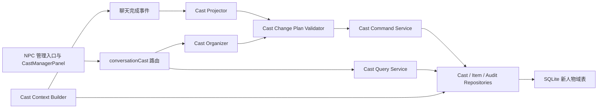

# NPC 系统重构架构

## 1. 目标与约束

本次重构把现有 NPC 运行时替换为统一的“人物域（Cast Domain）”。NPC 仍是用户界面中的业务名称，代码和数据内部使用稳定的人物 ID，避免名称改动、别名和同名人物导致跨表错配。

必须满足以下约束：

- 聊天头部现有 `NPC 管理` 入口、位置、点击事件和打开方式不变。
- 名册、资料、位置、记忆、行为、主角与 NPC 物品/衣物、审计回滚、自动同步及 AI 整理功能保留。
- 独立 `NPC Agent`、模型覆盖、NPC 工具调用、工具循环和旧提示词全部移除。
- 旧运行时代码先删除，新运行时代码后接入；最终不存在双写、旧 API 兼容路由或并行实现。
- 旧数据库只作为一次性迁移输入。迁移成功后旧表在同一事务中移除；失败时全部回滚。
- 模型只能提出结构化变更计划，不能直接调用工具或写数据库。
- 所有影响人物的数据变更均由同一应用服务完成归属校验、规范化、去重、事务和审计。

## 2. 总体分层



依赖方向固定为：路由或聊天编排 -> 应用服务 -> 纯领域规则与仓储 -> SQLite。仓储不得导入应用服务；提示词不得导入仓储；跨模块不得直接写人物域表。

## 3. 新数据模型

### 3.1 `cast_members`

人物主体，包含主角和 NPC：

- `id`：稳定人物 ID。
- `conversation_id`：所属对话。
- `member_type`：`protagonist` 或 `npc`。
- `canonical_name`、`name_key`：正式名及 NFKC、去首尾空白、大小写折叠后的解析键。
- `source`、`evidence`、`confidence`：来源与证据。
- `visibility`：`visible` 或 `hidden`。
- `status`、`custom_status`、`relationship`。
- `current_location_label`、`current_scene_node_id`：自由文本位置与可选场景节点。
- `memory_sealed`、`created_at`、`updated_at`。

约束：同一对话的 `name_key` 唯一；每个对话最多一个主角；隐藏只改变可见性，不级联删除资料。

### 3.2 `cast_member_aliases`

- `member_id`、`conversation_id`、`alias`、`alias_key`、`created_at`。
- 同一人物别名键唯一；同一对话别名键唯一。
- 领域服务同时检查别名与正式名冲突，冲突返回 409，不做猜测性合并。

### 3.3 `cast_memories`

- `id`、`conversation_id`、`member_id`。
- `memory_type`、`content`、`content_key`。
- `layer`、`importance`、`emotional_intensity`、`decay_rate`。
- `last_reinforced_at`、`reinforcement_count`、`forgotten_at`。
- `linked_memory_ids_json`、`shared_member_ids_json`。
- `source_kind`、`source_message_id`、`created_at`、`updated_at`。

`content_key` 用规范化内容哈希生成，同一人物重复内容由数据库唯一约束和服务端合并策略共同阻止。封存人物拒绝自动同步和 AI 整理写入，但允许用户手动操作。

### 3.4 `cast_behaviors`

- `id`、`conversation_id`、`member_id`。
- `behavior_type`、`trigger_condition`、`action`、`rule_key`。
- `priority`、`enabled`、`source_kind`、`created_at`、`updated_at`。

`rule_key` 由触发条件和动作规范化后生成；同一人物重复规则合并而不是追加。

### 3.5 人物扩展表

- `cast_personality_anchors`：以 `member_id` 保存人格锚点。
- `cast_emotion_states`、`cast_emotion_history`：以 `member_id` 保存情绪状态和历史。
- `cast_appearances`：以 `member_id` 保存主角或 NPC 外貌。
- `cast_activities`：以 `member_id` 关联世界时间活动。
- `cast_turn_queue`：以 `member_id` 关联多角色待处理回合。
- `conversation_turns` 增加可空 `speaker_member_id`，不再以 NPC 名称作为关联键。

### 3.6 人物物品与衣物

保留通用 `scene_items` 表名，但重建所有权结构：

- `owner_kind` 仅允许 `world` 或 `cast`。
- `owner_member_id` 指向 `cast_members.id`，主角和 NPC 不再写名称所有权。
- 世界物品要求 `node_id`，人物物品要求 `owner_member_id`；两者互斥。
- `item_kind`、`quantity`、`clothing_slot`、`equipped`、`coverage_json` 等现有能力保留。

世界物品由场景服务管理；人物持有、转移、穿戴和删除由人物命令服务协调物品仓储完成。跨世界/人物转移仍在一个事务内完成。

### 3.7 `cast_change_batches`

记录一次手动、自动或 AI 批量变更：

- `id`、`conversation_id`、`source_kind`、`scope_member_id`。
- `idempotency_key`、`status`、`plan_json`、`result_json`。
- `created_at`、`applied_at`。

同一对话的 `idempotency_key` 唯一。聊天自动同步使用最终 assistant message ID 生成键；网络重试不会重复写入。

### 3.8 `conversation_audit_events`

替换 `npc_profile_audit`、`npc_item_audit`、`appearance_audit`，并承接人物物品的旧审计：

- `id`、`conversation_id`、`member_id`、`batch_id`。
- `subject_type`、`subject_id`、`action`、`actor_kind`。
- `before_json`、`after_json`、`rollback_of_event_id`、`created_at`。

回滚必须重新进入人物命令服务。只有当前实体快照仍等于审计事件的 `after_json` 时才能直接回滚；发生后续修改时返回 409，避免覆盖新数据。回滚本身产生新的审计事件。

## 4. 统一结构化变更计划

自动同步和 AI 整理共用 `CastChangePlanV1`。模型只返回 JSON，不接收任何工具定义。

```json
{
  "version": 1,
  "summary": "本轮人物状态变化",
  "operations": [
    {
      "op": "member.update",
      "target": { "memberId": "member-id" },
      "changes": { "currentLocationLabel": "钟楼" },
      "evidence": { "messageId": "assistant-message-id", "quote": "她登上钟楼。" },
      "confidence": 0.96
    }
  ]
}
```

允许的操作：

- `member.create`、`member.update`、`member.hide`、`member.restore`。
- `memory.create`、`memory.update`、`memory.delete`。
- `behavior.create`、`behavior.update`、`behavior.delete`。
- `item.upsert`、`item.transfer`、`item.delete`。
- `appearance.update`。

模型不得提交 `conversationId`、审计 actor、批次状态、SQL 字段名或任意未声明字段。服务端从认证上下文注入对话、用户、来源和作用域。

### 4.1 校验顺序

1. 从模型回复中提取一个 JSON 对象；拒绝多个对象或对象外的可执行内容。
2. 使用严格 schema 校验版本、字段、枚举、长度、数值范围和操作数量。
3. 将名称或别名解析为稳定人物 ID；解析歧义直接失败。
4. 检查作用域：单人物整理不得修改其他人物；自动同步不得隐藏、删除或改写历史记录。
5. 检查证据：自动同步的证据 message ID 必须属于本轮允许集合，引用内容必须能在消息中定位。
6. 规范化名称、别名、内容键、规则键和物品代码，移除无变化操作并合并重复操作。
7. 在事务中重新读取目标版本，应用命令并写审计；任一操作失败则整批回滚。

限制：自动同步最多 40 个操作，单人物整理最多 80 个操作，全对话整理最多 200 个操作；超限不截断，直接拒绝并提示缩小范围。

### 4.2 来源权限

| 来源 | 允许范围 | 禁止行为 |
| --- | --- | --- |
| `manual` | 当前用户明确请求的 CRUD 和回滚 | 绕过会话归属与输入限制 |
| `auto_sync` | 本轮新增人物、明确资料变化、新记忆、新稳定行为和明确物品变化 | 删除、隐藏、回滚、覆盖封存记忆、无证据修改 |
| `ai_organize` | 用户选择的人物或全对话范围内的去重、修正、增删改 | 越过所选作用域、修改主角身份、绕过封存规则 |
| `migration` | 一次性等价搬迁 | 通过 HTTP 或模型触发 |

## 5. 应用服务与文件边界

后端目标结构：

```text
backend/src/domain/cast/
  constants.js
  normalization.js
  changePlan.js
backend/src/repositories/
  castRepository.js
  castItemRepository.js
  auditRepository.js
backend/src/services/cast/
  castCommandService.js
  castQueryService.js
  castPlanService.js
  castProjector.js
  castOrganizer.js
  castContextBuilder.js
backend/src/services/prompts/
  castProjectionPrompt.js
  castOrganizerPrompt.js
backend/src/routes/
  conversationCast.js
backend/src/db/migrations/
  castDomainV1.js
```

职责：

- `domain/cast` 只包含纯规则、类型约束和规范化，无数据库或供应商依赖。
- `repositories` 是人物域 SQL 的唯一位置，不做业务决策。
- `castCommandService` 是人物写入唯一入口，拥有事务、归属、冲突、去重和审计。
- `castQueryService` 负责列表、详情、分页和跨模块只读投影。
- `castPlanService` 校验并通过 `castCommandService` 原子应用计划。
- `castProjector` 与 `castOrganizer` 只准备上下文、调用当前聊天供应商和提交计划。
- `castContextBuilder` 生成有预算的只读人物上下文；主回复不获得人物工具。
- 路由只处理认证、HTTP/SSE 映射和输入 schema，不直接执行 SQL。

跨模块只允许依赖 `castQueryService` 和 `castCommandService` 的公开接口。静态测试禁止 `npc_*` 旧表名及新人物域表名出现在仓储、迁移、schema 和测试夹具之外。

## 6. 自动同步与 AI 整理

### 6.1 自动同步

- 配置键为 `castTracking.enabled`，仅有开关，没有角色、提示词编辑或模型覆盖。
- assistant 消息成功持久化后，由聊天编排器提交后台投影任务。
- 投影器使用当前聊天供应商和当前聊天模型，直接调用无工具的文本补全。
- 输入仅包含当前 user/assistant 观察窗口、精简人物名册、相关已知事实和严格 JSON 契约。
- 状态事件改为 `cast-sync` 的 `queued/running/applied/skipped/error`；不再发送 `npcAgent` 附件任务结果。
- 同一消息 ID 幂等；切换对话后旧事件不得刷新当前面板。

### 6.2 AI 整理

- 单人物整理只读取所选人物、相关物品与限定消息窗口。
- 全对话整理读取服务端压缩后的全人物数据，并按预算选择对话证据。
- 两种整理都只生成一次 `CastChangePlanV1`，不进入工具多轮循环。
- SSE 只发送 `context`、`generating`、`validating`、`applying`、`done/error` 阶段和安全摘要，不执行模型工具调用。
- 取消通过请求 `AbortSignal` 传递；供应商超时和应用事务超时分别处理。

## 7. HTTP API

旧 `/npcs*` API 将删除，前端在同一重构中切换到新接口，不提供兼容路由。

- `GET /api/conversations/:id/cast`：名册、主角摘要、统计和同步状态。
- `POST /api/conversations/:id/cast/cleanup`：隐藏确认的空人物。
- `GET /api/conversations/:id/cast/:memberId`：人物详情。
- `PATCH /api/conversations/:id/cast/:memberId`：资料、位置、别名、封存和可见性。
- `GET/POST /api/conversations/:id/cast/:memberId/memories`。
- `PATCH/DELETE /api/conversations/:id/cast/:memberId/memories/:memoryId`。
- `GET/POST /api/conversations/:id/cast/:memberId/behaviors`。
- `PATCH/DELETE /api/conversations/:id/cast/:memberId/behaviors/:behaviorId`。
- `GET/POST /api/conversations/:id/cast/:memberId/items`。
- `PATCH/DELETE /api/conversations/:id/cast/:memberId/items/:itemId`。
- `GET /api/conversations/:id/cast/:memberId/audit`。
- `POST /api/conversations/:id/cast/audit/:eventId/rollback`。
- `POST /api/conversations/:id/cast/organize`：单人物或全对话 SSE 整理。

所有接口先校验认证用户拥有对话；子资源必须同时匹配 `conversation_id` 和 `member_id`。写入 body 使用严格 schema，并设置字符串、数组、分页和批量上限。

## 8. 前端架构与交互

目标结构：

```text
frontend/src/api/cast.js
frontend/src/composables/cast/useCastManager.js
frontend/src/composables/cast/useCastOrganizer.js
frontend/src/components/cast/CastManagerPanel.vue
frontend/src/components/cast/CastRoster.vue
frontend/src/components/cast/CastProfileEditor.vue
frontend/src/components/cast/CastMemoryList.vue
frontend/src/components/cast/CastBehaviorList.vue
frontend/src/components/cast/CastInventory.vue
frontend/src/components/cast/CastAuditTimeline.vue
frontend/src/components/cast/CastOrganizerBar.vue
```

- `ChatHeader` 保持现有 `NPC 管理` 入口与事件。
- `ChatView` 只负责面板挂载、开关和当前对话 ID，不保存内部列表、编辑或整理状态。
- `useCastManager` 按对话 ID 隔离请求 token、取消器、选择、加载、错误和 mutation 状态。
- `useCastOrganizer` 单独管理 SSE、进度、取消和结果；关闭面板不让旧请求污染新对话。
- API 模块只负责请求与响应规范化，不含 UI 状态。

### 8.1 桌面布局

- 使用一个右侧工作抽屉，不嵌套装饰卡片。
- 顶部保留紧凑标题、同步状态、搜索、全局整理和关闭按钮。
- 左侧为 260-300px 人物列表，主角固定在顶部，NPC 支持搜索、状态筛选和空资料清理。
- 主工作区显示人物标题与状态，使用 `资料 / 记忆 / 行为 / 物品 / 审计` 标签页。
- 当前人物 AI 整理为工作区底部命令栏；全局整理从顶部打开同一命令栏的全局模式。

### 8.2 移动布局

- 抽屉占满视口；名册与详情使用两级视图，详情页有明确返回按钮。
- 标签栏可横向滚动但页面本身不得横向溢出。
- 所有触控目标至少 44px；底部命令栏避开安全区和软键盘。

### 8.3 可访问性与状态

- 图标按钮使用 `@lucide/vue`，均有可读 `aria-label` 和 tooltip。
- 列表与标签支持键盘方向键、Home/End、Enter/Space；焦点在视图切换后移到对应标题。
- 对话框使用焦点陷阱、Escape 关闭和关闭后焦点恢复。
- 动态同步、整理进度和错误使用 `aria-live`；装饰图标设 `aria-hidden`。
- 加载骨架、空状态、局部错误、重试、保存中、并发冲突和只读封存状态均有独立呈现。
- 动画只使用 opacity/transform，并遵守 `prefers-reduced-motion`。
- z-index 使用项目统一层级，不使用任意极大值。

## 9. 一次性事务迁移

迁移键：`_schema_meta.cast_domain_v1 = 1`。

执行顺序：

1. 检查新表结构和旧表存在情况；已完成版本直接返回。
2. 关闭外键检查并开始事务，建立临时新表。
3. 为每个对话创建主角人物；汇总旧 registry、记忆、行为、物品、活动、HMDT、外貌和回合队列中出现的 NPC 名称。
4. 按 `name_key` 建立人物映射；同键旧记录确定性合并，并写迁移审计说明。
5. 按依赖顺序迁移别名、记忆、行为、外貌、情绪、活动、回合、物品和旧审计，保留可保留的原 ID 与时间戳。
6. 校验各类源记录数与目标记录数、人物引用、物品所有权、JSON 可解析性和 `PRAGMA foreign_key_check`。
7. 校验通过后删除旧 NPC 表和已被替代的审计表，替换 `scene_items` 结构，写入迁移版本并提交。
8. 任一异常回滚全部 DDL/DML，恢复外键设置并让启动失败；不得留下部分迁移或版本标记。

新安装只创建新表，不创建旧 NPC 表。迁移函数可重复调用；完成后不再读取旧表，也不保留运行时兼容判断。

## 10. 删除与接入顺序

1. 删除暂停前的 `npcStateProjector.js` 草稿和临时 `castTracking` 接入，回到无新运行时状态。
2. 删除旧 NPC Agent、工具定义/执行、查询工具注入、整理器、提示词、配置和事件分支。
3. 删除旧 NPC 路由、模块、面板、API 包装和只验证旧实现的测试；保留聊天头部入口壳。
4. 移除旧表的新建语句和旧索引；现有数据库中的旧表保持原样等待事务迁移。
5. 建立新 schema、迁移、领域、仓储和命令/查询服务。
6. 接入无工具投影器、整理器、新 API 和新前端面板。
7. 迁移场景、动态世界、多角色、HMDT、快照和诊断等消费者。
8. 完成全量测试和残留扫描，确认没有旧运行时或双写路径。

该顺序允许中间工作树暂时不可运行，但最终变更只包含一个人物运行时。

## 11. 架构验收规则

- 任何模型请求中不存在 NPC 查询或写入工具定义。
- `generateCompletion` 的人物投影与整理调用不传 `tools` 或 `executeTool`。
- 任何人物写 SQL 只存在于指定仓储和迁移文件。
- 所有写接口都调用 `castCommandService` 或 `castPlanService`。
- 新旧表不双写；迁移完成后旧表不存在。
- 正式名和别名解析不依赖模糊包含匹配。
- 自动同步重试幂等，整批失败无部分写入。
- 审计回滚检测后续冲突并产生新审计事件。
- 主回复只接收服务端构建的压缩人物上下文，不获得人物工具。
- 前端入口事件不变，旧 `NpcPanel`、旧 API 和 `npcAgent` 状态事件无残留。
